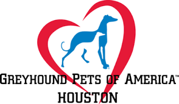

# Houston Great Global Greyhound Walk 2026

	

Planning repository for the **2026 Houston Great Global Greyhound Walk**, affiliated with **Greyhound Pets of America Houston**.

## Event at a glance

| | |
|---|---|
| **Date** | Sunday, September 27, 2026 |
| **Location** | Memorial Park, Houston — exact picnic facility pending written confirmation |
| **Planned hours** | 8:00–10:30 a.m. |
| **Format** | Short, noncompetitive leashed sighthound walk followed by an optional bring-your-own picnic |
| **Capacity** | 50 people maximum, including volunteers |
| **Theme** | Mythical Mutts |

All dogs will remain leashed. Each household will bring and consume its own picnic food; organizers will not provide or distribute food.

> **Planning status:** Venue details and required approvals are still being confirmed. This repository does not indicate that the event or location has received final approval.

## Planning documents

Start with the **[event-planning overview](event-planning/README.md)** for the document index and current critical path.

Key resources include:

- [Event charter](event-planning/event-charter.md)
- [Action tracker](event-planning/action-tracker.md)
- [Timeline and milestones](event-planning/timeline.md)
- [Venue and permits](event-planning/venue-permits.md)
- [Operations plan](event-planning/operations-plan.md)
- [Safety and contingency plan](event-planning/safety-plan.md)
- [Communications plan](event-planning/communications-plan.md)
- [Event-day run of show](event-planning/run-of-show.md)
- [Equipment checklist](event-planning/equipment-checklist.md)
- [Contacts and decisions](event-planning/contacts-decisions.md)
- [Official reference links](webpages.md)

## Project principles

- Keep attendance at or below 50 people, including volunteers.
- Count people and sighthounds separately.
- Treat all items marked **Pending confirmation** as unapproved.
- Maintain short-route and weather-modification options.
- Collect only the registration and accessibility information needed to run the event safely.

## Rendering review PDFs

This repository includes a Node.js utility that renders the Markdown planning documents as letter-size PDFs for review.

1. Install dependencies with `npm install`.
2. Generate review copies with `npm run render:pdf`.

The generated files are written to `review-pdfs/` and excluded from version control.

## About the Great Global Greyhound Walk

The [Great Global Greyhound Walk](https://greatglobalgreyhoundwalk.co.uk/) is an annual worldwide celebration of greyhounds and other sighthounds. See [`webpages.md`](webpages.md) for official event, venue, and City of Houston planning references.
