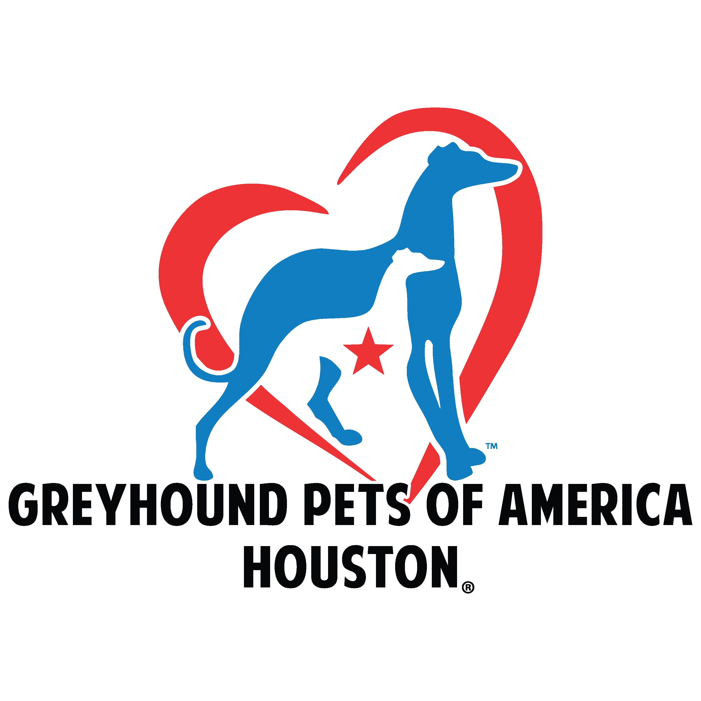

	

	Planning workspace for Houston's 2026 Great Global Greyhound Walk, 
	affiliated with <strong>Greyhound Pets of America Houston</strong>.

## Event overview

| Detail | Plan |
|---|---|
| **Date** | Sunday, September 27, 2026 |
| **Public hours** | 9:00 a.m.–12:00 p.m. |
| **Venue** | Memorial Park, Houston — exact picnic facility pending written confirmation |
| **Format** | Short, noncompetitive leashed sighthound walk followed by an optional bring-your-own picnic |
| **Capacity** | 50 people maximum, including volunteers |
| **GGGW theme** | Mythical Mutts |

All dogs remain leashed. Each household brings and consumes its own food; organizers do not provide or distribute food.

> [!IMPORTANT]
> This repository contains planning materials. Items marked **Pending confirmation** are unapproved, and the repository does not establish that the venue or event received final approval.

## Repository guide

Begin with the **[planning overview](event-planning/README.md)** for the full document index and critical path.

| Area | Document |
|---|---|
| Scope and goals | [Event charter](event-planning/event-charter.md) |
| Tasks and ownership | [Action tracker](event-planning/action-tracker.md) |
| Deadlines and gates | [Timeline and milestones](event-planning/timeline.md) |
| Venue requirements | [Venue and permits](event-planning/venue-permits.md) |
| Route, staffing, and attendance | [Operations plan](event-planning/operations-plan.md) |
| Risks and emergency response | [Safety and contingency plan](event-planning/safety-plan.md) |
| Attendee messaging | [Communications plan](event-planning/communications-plan.md) |
| Event-day schedule | [Run of show](event-planning/run-of-show.md) |
| Supplies and packing | [Equipment checklist](event-planning/equipment-checklist.md) |
| Budget | [Budget tracker](event-planning/budget-tracker.md) |
| Decisions and correspondence | [Contacts and decisions](event-planning/contacts-decisions.md) |
| Official sources | [Reference links](webpages.md) |

## Planning principles

- Keep the total onsite population at or below 50 people, including volunteers.
- Track people and sighthounds separately.
- Keep every dog leashed; no race, timed event, or off-leash activity is in scope.
- Maintain short-route and weather-modification options.
- Keep the picnic household-based rather than a potluck or shared buffet.
- Collect only the information needed for registration, accessibility, emergency communication, and attendance reporting.

## Generate review PDFs

The repository includes a Node.js utility that renders the Markdown planning documents as letter-size PDFs.

**Requirements:** Node.js 18 or newer and npm.

1. Run `npm install`.
2. Run `npm run render:pdf`.

Generated files are written to `review-pdfs/` and excluded from version control.

## About GGGW

The [Great Global Greyhound Walk](https://greatglobalgreyhoundwalk.co.uk/) is an annual worldwide celebration of greyhounds and other sighthounds. Additional official event, venue, and City of Houston sources are listed in [`webpages.md`](webpages.md).
