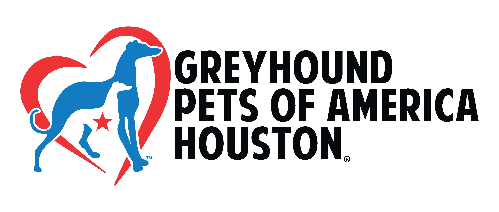

# Contacts and Decisions

	

## Contact directory

Do not store sensitive personal information. Use organizational contact details whenever possible.

| Organization/role | Name | Email/phone | Purpose |
|---|---|---|---|
| GPA Houston sponsor | CN | caitlynn@gpahouston.org, 832-297-2382 | Authorization, branding and budget |
| GGGW coordinator | CN, LW, GW | team@greatglobalgreyhoundwalk.co.uk, caitlynn@gpahhouston.org, laurenw@gpahouston.org, 832-297-2382 | Registration and count |
| Event lead | CN | caitlynn@gpahouston.org, 832-297-2382 | Overall management |
| Safety lead | CN | caitlynn@gpahouston.org, 832-297-2382 | Weather and incidents |
| Registration lead | GN, LW | laurenw@gpahouston.org, 832-716-5752 | Capacity and attendee communications |
| GPAH Emergency Info | Team | 832-813-5426 | Lost greyhound |
| Emergency veterinarian | Gulf Coast Veterinary Specialist | 713-693-1111| Animal emergency |
| Houston emergency | Dispatcher | 911 | Life safety |
| Houston non-emergency | 311 | 311 | City/park issue |
