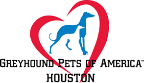

# Help the Houston Hounds Walk Together

	

## Great Global Greyhound Walk — Houston

**Sunday, September 27, 2026**  
**9:00 a.m.–12:00 p.m.**  
**Memorial Park, Houston**  
**N Picnic Ln, Houston, TX 77007**

Greyhound Pets of America Houston is planning a relaxed, noncompetitive leashed sighthound walk followed by an optional bring-your-own picnic. The 2026 Great Global Greyhound Walk theme is **Mythical Mutts**.

## Volunteers requested

We are seeking **3–4 volunteers** to help with event setup, check-in, walk support, the GPA Houston information station, and cleanup.

## Equipment and materials requested

- One table
- One 10 × 10 ft tent canopy
- GPA Houston banner or sign
- GPA Houston adoption, foster, and volunteer materials
- One large water dispenser
- Large water bowls for the hounds

Please let the event lead know which volunteer role or requested item you can provide. All equipment use is subject to written Memorial Park approval, including canopy placement and weighting requirements.